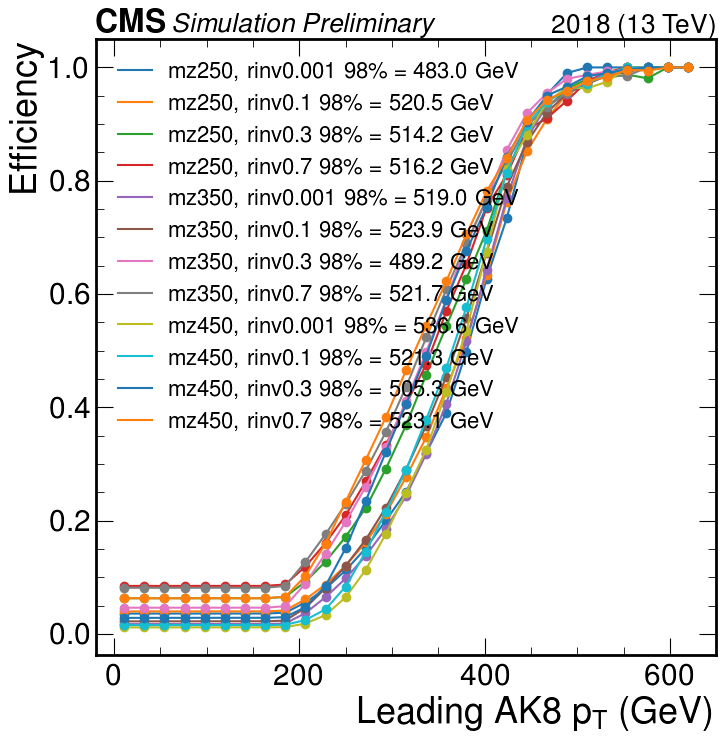
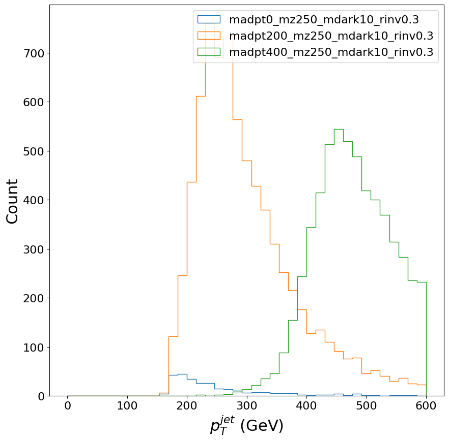
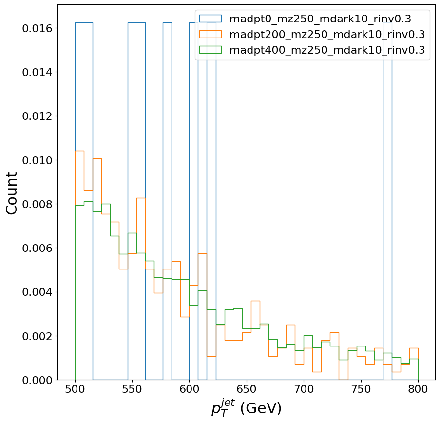

# Trigger study for the boosted SVJ analysis

## Setup

```
python3 -m venv env
source env/bin/activate  # Needed every time
pip install numpy uproot seutils matplotlib requests
git clone git@github.com:boostedsvj/triggerstudy.git
```


## Producing/dowloading the columns

The column files are .npz files that store the basic variables per event needed for the trigger study: leading AK8 jet pT, HT, the trigger decisions per event, etc. The signal columns can be produced on the fly. The background is too large to produce on the fly; see the [bkg](bkg) directory for more instructions.


For tuning the madpt cut:

```
python produce_signal_columns.py -d columns/madptcut_tuning root://cmseos.fnal.gov//store/user/lpcdarkqcd/boosted/orthogonalitystudy/HADD/madpt0_mz250_mdark10_rinv0.3.root root://cmseos.fnal.gov//store/user/lpcdarkqcd/boosted/orthogonalitystudy/HADD/madpt200_mz250_mdark10_rinv0.3.root root://cmseos.fnal.gov//store/user/lpcdarkqcd/boosted/orthogonalitystudy/HADD/madpt400_mz250_mdark10_rinv0.3.root
```

For the trigger efficiency plots:

```
python produce_signal_columns.py -d columns/noboost root://cmseos.fnal.gov//store/user/lpcdarkqcd/MCSamples_UL_Spring2022_NOBOOST/HADD/*.root
```

## Plotting the trigger efficiency for signal

```bash
python plot_trigeff.py columns/noboost/*.npz
```




## Checking the madpt cut

Plot the AK reco jet pt distribution:

```
python check_madpt_cut.py columns/madptcut_tuning/madpt*.npz
```



`madpt0` and `madpt200` are quite alike, except that `madpt200` has way more statistics; this is expected, as there is a 170 GeV jet cut-off in TreeMaker. `madpt400` starts way higher into the spectrum, as expected. Zoom in on the tails:

```
python check_madpt_cut.py columns/madptcut_tuning/madpt*.npz --highptzoomin
```



If the madpt cut is orthogonal to the AK8 jet pt > 500 cut, we would expect identical distributions here. Clearly the `madpt0` sample has too few statistics. It looks like `madpt400` is slightly different from `madpt200` in the very low end of the distribution, so perhaps it is slightly too aggressive. A madpt cut of 300 seems like a reasonable tradeoff between not generating too many useless events (AK8 jet pt < 500) and not modifying the distributions that survive the trigger threshold cut (AK8 jet pt >= 500).