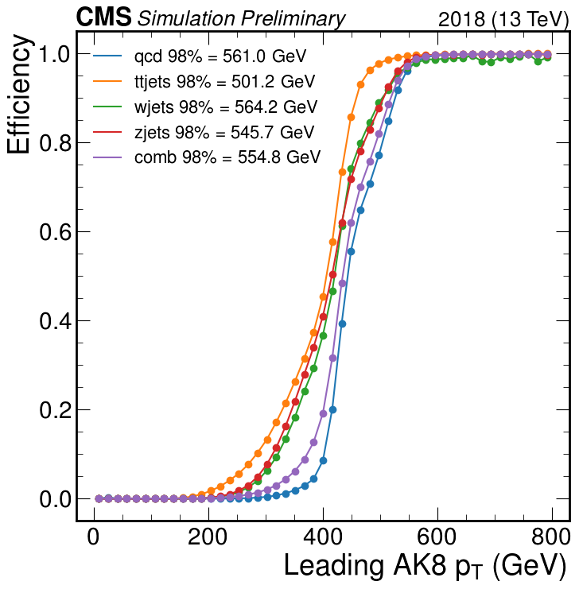
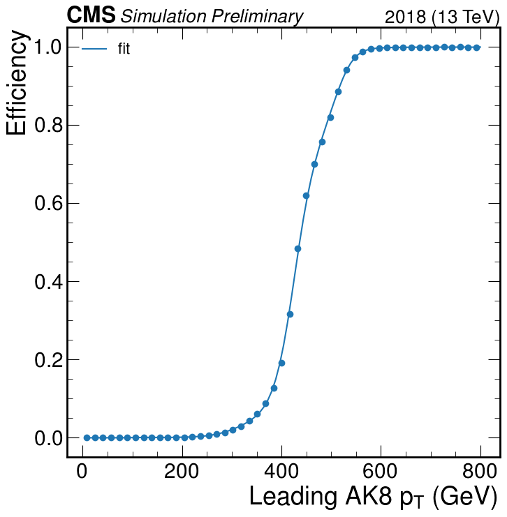

## Producing the trigger study columns for background

Processing the entire background requires using jobs.

First install jdlfactory:

```bash
pip install jdlfactory
```

Then run (don't forget to renew your grid proxy):

```bash
python submit.py
cd bkgcols
condor_submit
```

This creates small .npz files for every background .root TreeMaker file at the stageout location specified in `submit.py` (e.g. `root://cmseos.fnal.gov//store/user/lpcdarkqcd/triggerstudy/bkg_Dec08/TRIGCOL/Summer20UL18/*`).


## Build histogram from all .npz files

Use (modify the stageout directory):

```bash
python build_histogram.py root://cmseos.fnal.gov//store/user/lpcdarkqcd/triggerstudy/bkg_Dec08/TRIGCOL/Summer20UL18/*/*.npz
```

This combines all the data in the .npz files into histograms, before and after triggers are applied. The resulting file is e.g. `histograms_Dec12.json`.


## Plot the background efficiency curve

```bash
python trigeff_bkg.py histograms_Dec12.json
```

This plots the curves + interpolations for all backgrounds individually (QCD, TTJets, WJets, ZJets) and the combined background.




## Fit the background efficiency curve

```bash
python trigeff_bkg.py histograms_Dec12.json --fit
```

The resulting fit parameters are stored in `bkg_trigeff_fit_2018.txt`.

The fit function is essentially:

```
y(x) = 1. / ( 1. + e^polynomial(x, degree=15) )
```

To use it in python, do:

```python
>>> import numpy as np, requests
>>> parameters = np.array(requests.get('https://raw.githubusercontent.com/boostedsvj/triggerstudy/main/jobs/bkg_trigeff_fit_2018.txt').json())
>>> poly = np.poly1d(parameters)
>>> fit = lambda x: np.where(x<800., 1./(1.+np.exp(-poly(x))), 1.)
>>> fit(np.array([200., 500., 800., 2000.]))
array([0.00143396, 0.83767488, 1.        , 1.        ])
```

